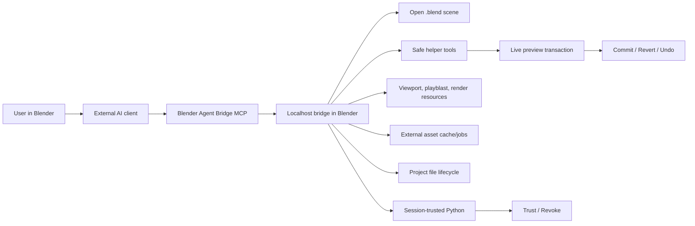

# Blender Agent Bridge

The safe, production-shaped bridge between Blender and external AI agents.

Blender Agent Bridge is a Blender extension plus a localhost MCP bridge. It lets tools such as Codex, Claude Desktop, Claude Code, Cursor, and other MCP-capable clients inspect the open Blender scene, gather visual evidence, make preview-capable edits, and run Python under explicit session trust.

<p align="center">
  
</p>

<p align="center">
  <a href="addon/claude_blender/blender_manifest.toml"></a>
  <a href="https://github.com/CallMeJones/blender-agent-bridge/releases/latest"></a>
  <a href="https://github.com/CallMeJones/blender-agent-bridge/actions/workflows/mcp-smoke.yml"></a>
  
  
  <a href="LICENSE"></a>
</p>

## Quick Start

1. Install Blender `4.2.0` or newer. CI continuously checks Blender 4.2 LTS, 4.5 LTS, and 5.1; newer versions are allowed and use capability checks rather than an artificial maximum-version gate.
2. In Blender, open `Edit > Preferences > Get Extensions`, add this remote repository, then sync and install `Blender Agent Bridge`:

   ```text
   https://callmejones.github.io/blender-agent-bridge/index.json
   ```

3. Enable the extension, open the 3D View sidebar, find `Agent Bridge`, and press `Start`.
4. Press `Copy MCP Config`, paste the generated config into your client, then refresh or restart it.
5. Ask the client:

   ```text
   List the objects in the current Blender scene and tell me which Blender Agent Bridge tools are available.
   ```

6. Try a reversible helper edit:

   ```text
   Move the selected cube up 1 Blender unit and make it red. Leave the change as a preview.
   ```

Preview edits stay pending in Blender until you use `Commit`, `Revert`, or Blender undo. Generated Python is refused while **Trust Agent Scripts** is off. With trust on, it runs immediately with the same filesystem, network, subprocess, project-file, persistent-cache, and Blender API permissions as Blender's **Run Script** command.

Bundled mode is the zero-install default. Optional `uvx / PyPI` setup and client-specific instructions are in the [client guide matrix](docs/clients/README.md).

Manual fallback: download `claude_blender-<version>.zip` from the [latest GitHub release](https://github.com/CallMeJones/blender-agent-bridge/releases/latest), then use Blender's `Install from Disk`. Do not install GitHub's generated source archive. See [Install from GitHub](docs/INSTALL_FROM_GITHUB.md) for updates, checksums, and troubleshooting.

The public beta is live: read the [release announcement](https://github.com/CallMeJones/blender-agent-bridge/discussions/12) and share structured [beta feedback](https://github.com/CallMeJones/blender-agent-bridge/discussions/13).

## After Updates

Restart Blender, press `Start`, copy the MCP config again, replace the old client config, and refresh or restart the client. This prevents cached server paths and tool lists from keeping an older extension active.

## Why This Exists

AI agents are getting good at using tools, but Blender needs guardrails. This bridge gives agents real scene context and practical tools without turning Blender into a chat app or storing provider API keys.

- Blender stays the execution layer: scene state, viewport evidence, preview changes, binary script trust, checkpoints, and local resources.
- The external client stays the agent host: model connection, conversation memory, provider account, planning, and user chat.
- Generated Python is not the default path. Agents get structured helpers first; arbitrary scripts are refused while trust is off and run immediately after the user grants runtime session trust.
- Blender has one deliberately small sidebar panel: bridge status/start-stop, `Copy MCP Config`, **Trust Agent Scripts**/**Revoke**, and pending preview **Commit**/**Revert**. Diagnostics, manifests, audit state, captures, and asset configuration stay in bridge/tool responses instead of returning as sidebar sections.
- Advanced work uses composable modeling, material, staging, animation, evidence, and asset-import helpers. Bespoke authored content uses one trusted script when those reusable operations are not expressive enough.

## Showcase: Egypt Dogfight

These compressed images come from the `egypt.blend` project used while testing the bridge. The agent inspected a scene, used helper/workflow tools, captured playblast and render evidence, repaired issues, kicked off longer render jobs through bridge tooling, and validated the resulting output without relying on shell scripts or hidden in-Blender chat loops.

<p align="center">
  
</p>

<p align="center">
  
</p>

| Visual evidence | Diagnostic close-up | Render/playblast review |
| --- | --- | --- |
|  |  |  |

The source `.blend` file and full 1080p videos are not committed here; the repository only includes small showcase exports so the GitHub checkout stays light. See [docs/assets/PROVENANCE.md](docs/assets/PROVENANCE.md) for their origin, hashes, licensing boundary, and known third-party-source limitations.

## What Agents Can Do

- Inspect the current scene, selection, materials, animation, rigs, cameras, nodes, render settings, and `.blend` health.
- Make reversible preview edits to common objects, materials, animation, lighting, cameras, rigs, and scene organization.
- Capture viewport, playblast, inspection-render, thumbnail, and render-job evidence.
- Search and import Poly Haven or Sketchfab assets through asynchronous download and import jobs.
- Run animation and background-render workflows, including progress polling and output validation.
- Use bounded project-directory tools, or run custom Blender Python only after the user enables session script trust.

## Safety Model

Connected agents do not get blanket access by default. Enabling session script trust deliberately grants broad Blender-process access.

| Path | Behavior |
| --- | --- |
| Preview edits | Show `Commit` and `Revert` controls in Blender and retain normal Blender undo support. |
| Project tools | Restrict generic file access to the current saved project directory. Save/open/new-project operations require explicit confirmed paths. |
| Local bridge | Off by default and bound to `127.0.0.1`. Optional bearer authentication is available; without it, any local client that can reach the bridge may call its tools. |
| Generated Python | Refused while trust is off. With trust on, it has Blender **Run Script** permissions, including filesystem, network, subprocess, project-file, persistent-cache, and full Blender API access. |
| Script trust | Runtime-only and visibly revocable. It clears on Revoke, file load, add-on reload, or Blender exit. Static findings are advisory, not a sandbox. |
| Credentials | Model-provider keys are never stored by the extension. Sketchfab tokens are redacted and are not saved in preferences, `.blend` files, or audit logs. |

See [SECURITY.md](SECURITY.md), [PRIVACY.md](PRIVACY.md), and [docs/SAFETY_MODEL.md](docs/SAFETY_MODEL.md) for the detailed model.

## Optional Sketchfab Auth

Poly Haven discovery and imports do not need a token. Sketchfab public search is also tokenless, but Sketchfab model downloads/imports need an API token.

Fill the empty `SKETCHFAB_API_TOKEN` field in the copied MCP config, then restart or refresh the client. The token must be available to the MCP server process; Blender Agent Bridge does not save it in preferences, `.blend` files, or audit logs.

## How It Works



The MCP surface stays compact and exposes searchable Blender tool schemas only when the client needs them. Blender owns the open scene, previews, evidence, and trusted execution; the external MCP client owns the model, conversation, and provider account.

See [docs/EXTERNAL_BRIDGE_MCP.md](docs/EXTERNAL_BRIDGE_MCP.md) for setup and troubleshooting.

Client-specific instructions: [Codex](docs/clients/CODEX.md), [Claude](docs/clients/CLAUDE.md), [Cursor](docs/clients/CURSOR.md), [VS Code/Cline/Roo](docs/clients/VSCODE.md), [ChatGPT](docs/clients/CHATGPT.md), [Gemini CLI](docs/clients/GEMINI.md), [OpenCode](docs/clients/OPENCODE.md), and [Ollama hosts](docs/clients/OLLAMA.md).

Community: browse the [curated showcase](docs/SHOWCASE.md), propose a [showcase submission](https://github.com/CallMeJones/blender-agent-bridge/issues/new?template=showcase.yml), join [Discussions](https://github.com/CallMeJones/blender-agent-bridge/discussions), report [issues](https://github.com/CallMeJones/blender-agent-bridge/issues), or read [Contributing](CONTRIBUTING.md) and [Adding a Tool](docs/ADDING_A_TOOL.md).

## Try These Prompts

With an object selected:

```text
Move the selected cube up 1 Blender unit and make it red.
```

```text
Make the selected cube bounce twice over 72 frames, getting smaller each bounce. Check it against the brief and leave it as a preview.
```

```text
Capture close-up inspection renders of the selected vehicle underside, review them against the brief, and suggest repair operations.
```

```text
Search Poly Haven for a sunset HDRI, cache it as an external asset job, poll until it is ready, then queue the import into the world as a preview.
```

```text
Render a playblast as a background job, poll it, assemble the MP4, and validate the output.
```

Live helper changes, including external asset imports, remain pending until you use `Commit`, `Revert`, or Blender undo. Generated Python never enters a pending approval queue: trust off refuses it, and trust on runs it immediately with Blender Run Script-equivalent permissions.

## Development

Contributor setup, build commands, and the complete test matrix live in [Development](docs/DEVELOPMENT.md), [Testing Guide](docs/TESTING_GUIDE.md), and [Release](docs/RELEASE.md). See [Contributing](CONTRIBUTING.md) before opening a change, and [Adding a Tool](docs/ADDING_A_TOOL.md) for registry and handler conventions.

The [documentation index](docs/README.md) links the architecture, MCP, preview, safety, client, and launch guides.

## License

Blender Agent Bridge source and release ZIPs are licensed under the GNU General Public License, version 3 or any later version. The Blender extension manifest declares this as `SPDX:GPL-3.0-or-later`; see [LICENSE](LICENSE) for the full license text. Release ZIPs include the license file at the package root. The separately distributed showcase media under `docs/assets/` is governed by [its provenance notice](docs/assets/PROVENANCE.md), not the extension's GPL license.
