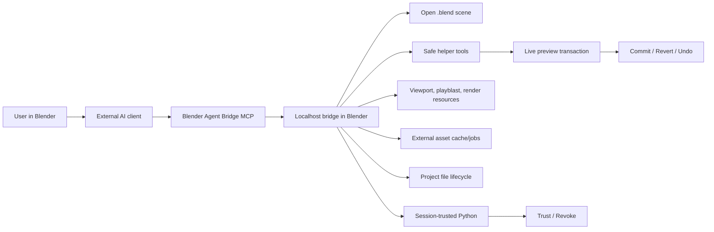

# Blender Agent Bridge

The safe, production-shaped bridge between Blender and external AI agents.

Blender Agent Bridge is a Blender extension plus a localhost MCP bridge. It lets tools such as Codex, Claude Desktop, Claude Code, Cursor, and other MCP-capable clients inspect the open Blender scene, gather visual evidence, call safe editing helpers, run Python under explicit session trust, and leave every helper edit in a visible commit/revert preview.

<p align="center">
  
</p>

<p align="center">
  <a href="addon/claude_blender/blender_manifest.toml"></a>
  <a href="https://github.com/CallMeJones/blender-agent-bridge/releases/latest"></a>
  <a href="https://github.com/CallMeJones/blender-agent-bridge/actions/workflows/mcp-smoke.yml"></a>
  
  
  <a href="LICENSE"></a>
</p>

> The project was originally named Claude for Blender. The internal add-on id, Python package, zip name, local paths, and MCP environment variables still use `claude_blender` for compatibility.

## Quick Start

1. Install Blender `4.2.0` or newer. CI continuously checks Blender 4.2 LTS, 4.5 LTS, and 5.1; newer versions are allowed and use capability checks rather than an artificial maximum-version gate.
2. In Blender, open `Edit > Preferences > Get Extensions`, add this remote repository, then sync and install `Blender Agent Bridge`:

   ```text
   https://callmejones.github.io/blender-agent-bridge/index.json
   ```

3. Enable the extension, open the 3D View sidebar, find `Agent Bridge`, and press `Start`.
4. Keep the default **Bundled** runtime, or select **uvx / PyPI** if you want a path-independent MCP process. Press `Copy MCP Config`, paste the generated config into your client, then refresh or restart it.
5. Ask the client:

   ```text
   List the objects in the current Blender scene and tell me which Blender Agent Bridge tools are available.
   ```

6. Try a reversible helper edit:

   ```text
   Move the selected cube up 1 Blender unit and make it red. Leave the change as a preview.
   ```

Live helper edits stay pending in Blender until you use `Commit`, `Revert`, or Blender undo. For Sketchfab downloads/imports, add `SKETCHFAB_API_TOKEN` to the copied MCP config `env` block before restarting the MCP client. Generated Python uses a binary runtime switch: with **Trust Agent Scripts** off it is refused without a pending dialog; with trust on it runs immediately with the same filesystem, network, subprocess, project-file, persistent-cache, and Blender API permissions as Blender's **Run Script** command. The confirmation warns that any client connected to the local bridge can use those permissions. Bounded tools remain the recommended path when their validation, recovery, provenance, or progress reporting is useful.

Bundled mode remains the zero-install default. Optional `uvx / PyPI` mode requires [`uv`](https://docs.astral.sh/uv/getting-started/installation/) and generates an exact version pin such as `uvx --from blender-bridge==0.3.1 blender-bridge`. Both modes expose the same registry and safety contracts; the protocol and registry digest handshake rejects incompatible combinations. See the [client guide matrix](docs/clients/README.md) for client- and OS-specific setup.

## After Updates

Some MCP clients cache server paths, source hashes, and tool lists. After updating the extension:

1. Restart Blender or disable/enable `Blender Agent Bridge`.
2. Open the `Agent Bridge` sidebar panel and press `Start`.
3. Press `Copy MCP Config`.
4. Replace the client config with the copied config.
5. Refresh or restart the MCP client.
6. Ask the client to call `blender_bridge_status` and confirm the add-on, MCP server, and source hash are current.

For a quick local smoke with Blender open and the bridge running:

```powershell
python scripts\live_bridge_smoke.py
```

After connecting, MCP results may include `guardrail_warnings`. These are advisory client-routing hints, not failures: follow them toward async external asset jobs, queued imports, background render/MP4 polling, user-confirmed file paths, session-trusted scripts, and preview commit/revert controls.

## Why This Exists

AI agents are getting good at using tools, but Blender needs guardrails. This bridge gives agents real scene context and practical tools without turning Blender into a chat app or storing provider API keys.

- Blender stays the execution layer: scene state, viewport evidence, preview changes, binary script trust, checkpoints, and local resources.
- The external client stays the agent host: model connection, conversation memory, provider account, planning, and user chat.
- Generated Python is not the default path. Agents get structured helpers first; arbitrary scripts are refused while trust is off and run immediately after the user grants runtime session trust.
- Blender has one deliberately small sidebar panel: bridge status/start-stop, `Copy MCP Config`, **Trust Agent Scripts**/**Revoke**, and pending preview **Commit**/**Revert**. Diagnostics, manifests, audit state, captures, and asset configuration stay in bridge/tool responses instead of returning as sidebar sections.
- Advanced helper paths include bounded procedural object kits and directed animation shot templates before custom Python fallback.

## Showcase: Egypt Dogfight

These compressed images come from the `egypt.blend` project used while testing the bridge. The agent inspected a scene, used helper/workflow tools, captured playblast and render evidence, repaired issues, kicked off longer render jobs through bridge tooling, and validated the resulting output without relying on shell scripts or hidden in-Blender chat loops.

<p align="center">
  
</p>

<p align="center">
  
</p>

| Visual evidence | Diagnostic close-up | Render/playblast review |
| --- | --- | --- |
|  |  |  |

The source `.blend` file and full 1080p videos are not committed here; the repository only includes small showcase exports so the GitHub checkout stays light. See [docs/assets/PROVENANCE.md](docs/assets/PROVENANCE.md) for their origin, hashes, licensing boundary, and known third-party-source limitations.

## What Agents Can Do

- Inspect scenes, selections, materials, animation data, rigs, cameras, render settings, compositor nodes, geometry nodes, collections, shape keys, particles, curves, text, and blend-file health.
- Read bounded viewport screenshots, sampled animation playblast frames, object inspection renders, render thumbnails, and long-render job resources through MCP.
- Check `.blend` diagnostics, save or autosave already-bound projects, and open or create project files only from user-confirmed paths.
- List, read, and create bounded files beneath the current saved `.blend` directory. Project-file tools reject unsaved projects, absolute/parent/hidden paths, filesystem links, executable code, libraries, and generic `.blend` writes.
- Search Poly Haven and Sketchfab catalogs, cache/import HDRIs, textures, and models, and report source, license, cache, and imported data-block diagnostics.
- Start external asset download/cache jobs for Poly Haven or Sketchfab, poll or cancel them, then import completed job results from cached manifests.
- Use animation workflow tools such as `run_animation_task`, `plan_animation_workflow`, `run_animation_workflow`, `review_playblast_against_brief`, and `run_animation_repair_loop`.
- Apply safe helper edits for transforms, materials, lights, cameras, primitives, keyframes, rigs, constraints, render settings, 2D storyboard/animatic panels, cutout animation layers, camera dolly shots, cloth setup, procedural array stacks, product stages, character/vehicle kits, geometry-node starters, and scene organization.
- Start long-running render jobs in a background Blender process, poll progress, assemble PNG sequences into MP4, and validate the output before reporting success.
- Search cached Blender Python API and Manual docs before using version-sensitive APIs, and use status/audit resources to spot stale client configs or timed-out work.
- Run custom or larger Blender Python only while session script trust is active, with helper/static-analysis advice and a 500k-character ceiling. Trust off refuses without creating pending UI; trust on grants Blender Run Script-equivalent permissions.

## Safety Model

Connected agents do not get blanket access by default. Enabling session script trust deliberately grants broad Blender-process access.

| Path | Behavior |
| --- | --- |
| Safe helper tools | Apply immediately as live preview transactions with `Commit`, `Revert`, and Blender undo support. |
| Visual capture tools | Store local project/session-scoped screenshots, playblast frames, inspection renders, thumbnails, and render outputs. |
| Project files | Save-as, save-copy, open, and new-project tools require a user-confirmed path. Autosave only saves an already-bound active `.blend` file in place. |
| External assets | Poly Haven uses public catalog/file APIs. Sketchfab downloads/imports accept a per-call token, the MCP server environment, or a masked memory-only Blender-session token. Tokens are redacted and never written to preferences, blend files, or job metadata. |
| Local bridge | Off by default and bound to `127.0.0.1`. Optional bearer authentication is available; without it, any local client that can reach the bridge may call its tools. |
| Generated Python | Refused without pending UI while trust is off; runs immediately while runtime-only session trust is active. Syntax errors and payloads above 500k are rejected operationally. |
| Trusted Python | Equivalent to manually using Blender **Run Script**: full Blender API plus the filesystem, network, subprocess, project-file, and persistent-cache access available to the Blender process. |
| External script trust | Explicit, runtime-only, session-scoped, and visibly revocable. It is cleared by Revoke, file load, add-on reload, or Blender exit. Static findings become warnings, not a sandbox or permission filter. |
| Audit and status | Local redacted JSONL audit events and bridge/MCP diagnostics are available through MCP resources and status calls. |
| MCP guardrail warnings | Advisory hints in catalog, schema, and tool results steer clients toward async jobs, queued imports, user-confirmed paths, session-trust checks, dry-run cleanup, preview commit/revert, and background-job polling. |
| Model provider keys | Not stored in Blender Agent Bridge. External clients bring their own model/provider connection. |

See [SECURITY.md](SECURITY.md), [PRIVACY.md](PRIVACY.md), and [docs/SAFETY_MODEL.md](docs/SAFETY_MODEL.md) for the detailed model.

## Install From GitHub

Best update-friendly path: add the GitHub Pages extension repository in Blender.

1. In Blender, open `Edit > Preferences > Get Extensions`.
2. Open the repositories menu, choose `Add Remote Repository`, and enter:

   ```text
   https://callmejones.github.io/blender-agent-bridge/index.json
   ```

3. Sync/update the repository, search for `Blender Agent Bridge`, and install it.
4. Enable `Blender Agent Bridge`.
5. Open the 3D View sidebar, find `Agent Bridge`, then use `Start` and `Copy MCP Config`.

Manual fallback: download the packaged ZIP from the latest GitHub Release.

1. Open the [latest GitHub release](https://github.com/CallMeJones/blender-agent-bridge/releases/latest).
2. Download `claude_blender-<version>.zip` from the release assets.
3. In Blender, open `Edit > Preferences > Get Extensions`, use `Install from Disk`, and choose the downloaded ZIP.
4. Enable `Blender Agent Bridge`, then use `Start` and `Copy MCP Config`.

Do not install GitHub's generated "Source code" ZIP as the Blender extension. Use the release asset or the remote extension repository.

See [docs/INSTALL_FROM_GITHUB.md](docs/INSTALL_FROM_GITHUB.md) for checksum verification, update steps, troubleshooting, and the maintainer release flow.

## Optional Sketchfab Auth

Poly Haven discovery and imports do not need a token. Sketchfab public search is also tokenless, but Sketchfab model downloads/imports need an API token.

Press `Copy MCP Config`, paste the result into your MCP client configuration, and fill its empty `SKETCHFAB_API_TOKEN` environment field before restarting or refreshing the client. Blender Agent Bridge does not save the token in add-on preferences, `.blend` files, or audit logs.

Manual fallback:

```json
"env": {
  "SKETCHFAB_API_TOKEN": "your-sketchfab-api-token"
}
```

`BLENDER_AGENT_BRIDGE_SKETCHFAB_API_TOKEN` is also accepted. For Claude Desktop, Claude Code, Codex, Cursor, and similar MCP clients, the token must be visible to the MCP server process, not just Blender. The MCP server forwards it to Blender as a redacted per-call argument because Blender often does not inherit the client environment.

Use `blender_bridge_status` and check `mcp_external_asset_auth.sketchfab` when debugging a stale config. Use `get_external_asset_cache_diagnostics` to inspect the Blender-side cache and auth view. OAuth is intentionally deferred for now; the supported public path is API-token auth.

## How It Works



The MCP surface is compact by default, so clients do not need to load the whole helper catalog into prompt context. They get a small direct surface for status, scene listing, `.blend` diagnostics, external asset discovery/jobs, animation workflows, and async render jobs, plus `blender_tool_catalog` / `search_blender_tools` to search compact summaries. Fetch one schema only when needed with `get_blender_tool_schema`, then call it through `invoke_blender_tool`. When a result includes `guardrail_warnings`, treat them as routing and recovery hints before retrying direct fallback tools.

Some MCP clients cache tool lists and server configs. After installing a new ZIP, reloading the add-on, or pressing `Copy MCP Config`, replace the old client config and refresh or restart that MCP client.

See [docs/EXTERNAL_BRIDGE_MCP.md](docs/EXTERNAL_BRIDGE_MCP.md) for setup and troubleshooting.

Client-specific instructions: [Codex](docs/clients/CODEX.md), [Claude](docs/clients/CLAUDE.md), [Cursor](docs/clients/CURSOR.md), [VS Code/Cline/Roo](docs/clients/VSCODE.md), [ChatGPT](docs/clients/CHATGPT.md), [Gemini CLI](docs/clients/GEMINI.md), [OpenCode](docs/clients/OPENCODE.md), and [Ollama hosts](docs/clients/OLLAMA.md).

Community: browse the [curated showcase](docs/SHOWCASE.md), propose a [showcase submission](https://github.com/CallMeJones/blender-agent-bridge/issues/new?template=showcase.yml), join [Discussions](https://github.com/CallMeJones/blender-agent-bridge/discussions), report [issues](https://github.com/CallMeJones/blender-agent-bridge/issues), or read [Contributing](CONTRIBUTING.md) and [Adding a Tool](docs/ADDING_A_TOOL.md).

## Try These Prompts

With an object selected:

```text
Move the selected cube up 1 Blender unit and make it red.
```

```text
Make the selected cube bounce twice over 72 frames, getting smaller each bounce. Check it against the brief and leave it as a preview.
```

```text
Block a jump with anticipation, contact, apex, and settle. Review spacing and contact before you report back.
```

```text
Capture close-up inspection renders of the selected vehicle underside, review them against the brief, and suggest repair operations.
```

```text
Render a 1080p playblast as a background job, poll it, assemble the MP4, and validate the output.
```

```text
Search Poly Haven for a sunset HDRI, cache it as an external asset job, poll until it is ready, then queue the import into the world as a preview.
```

```text
Check whether Sketchfab auth is available in this MCP config, then search for a downloadable Falcon 9 model, start an external asset download job if the token is present, poll it, queue the import job, and poll until the import completes.
```

```text
Check the current blend-file diagnostics and autosave only if the scene is already saved to a real .blend path.
```

Live helper changes, including external asset imports, remain pending until you use `Commit`, `Revert`, or Blender undo. Generated Python never enters a pending approval queue: trust off refuses it, and trust on runs it immediately with Blender Run Script-equivalent permissions.

## Install From Source

Build and validate the extension ZIP from the repository root:

```powershell
$Version = python -c "import tomllib; print(tomllib.load(open('addon/claude_blender/blender_manifest.toml','rb'))['version'])"
blender --command extension validate addon\claude_blender
python scripts\build_extension_zip.py --blender blender
blender --command extension validate "dist\claude_blender-$Version.zip"
```

The build writes:

```text
dist/claude_blender-<version>.zip
dist/claude_blender-<version>.zip.sha256
```

For day-to-day development on Windows, link the checkout into Blender's user extension repository:

```powershell
.\scripts\link_blender_dev_extension.ps1
```

See [docs/DEVELOPMENT.md](docs/DEVELOPMENT.md) for alternate Blender versions and custom extension repositories.

## Development Checks

Run pure-Python checks:

```powershell
python -m compileall addon\claude_blender tests
python -m unittest discover -s tests\unit -p "test_*.py" -v
python tests\smoke_helper_routing.py
python tests\smoke_release_consistency.py
python tests\smoke_bridge_protocol_validation.py
python tests\smoke_script_analysis.py
python tests\smoke_script_analysis_bypass.py
python tests\smoke_mcp_server.py
python tests\smoke_build_extension_zip.py
python tests\smoke_audit_log.py
python tests\smoke_external_assets.py
```

Set `BLENDER_AGENT_BRIDGE_LIVE_PAGES_SMOKE=1` before `smoke_release_consistency.py` to also verify the deployed GitHub Pages extension index advertises the current manifest version and that its hosted ZIP matches the advertised SHA-256 hash.

Optional live-network external asset smoke is skipped by default:

```powershell
$env:BLENDER_AGENT_BRIDGE_LIVE_EXTERNAL_ASSET_SMOKE='1'
python tests\smoke_external_assets_live.py
```

Set `BLENDER_AGENT_BRIDGE_LIVE_EXTERNAL_ASSET_DOWNLOAD=1` to also download small assets. Sketchfab download smoke additionally requires `SKETCHFAB_API_TOKEN` or `BLENDER_AGENT_BRIDGE_SKETCHFAB_API_TOKEN` plus `BLENDER_AGENT_BRIDGE_LIVE_SKETCHFAB_UID`.

Run Blender-background smoke tests when Blender is available:

```powershell
& 'C:\Program Files\Blender Foundation\Blender 5.1\blender.exe' --background --factory-startup --python-exit-code 1 --python tests\smoke_context_docs.py
& 'C:\Program Files\Blender Foundation\Blender 5.1\blender.exe' --background --factory-startup --python-exit-code 1 --python tests\smoke_bridge_server.py
& 'C:\Program Files\Blender Foundation\Blender 5.1\blender.exe' --background --factory-startup --python-exit-code 1 --python tests\smoke_animation_helpers.py
& 'C:\Program Files\Blender Foundation\Blender 5.1\blender.exe' --background --factory-startup --python-exit-code 1 --python tests\smoke_tool_selection.py
& 'C:\Program Files\Blender Foundation\Blender 5.1\blender.exe' --background --factory-startup --python-exit-code 1 --python tests\smoke_project_files.py
& 'C:\Program Files\Blender Foundation\Blender 5.1\blender.exe' --background --factory-startup --python-exit-code 1 --python tests\smoke_render_jobs.py
& 'C:\Program Files\Blender Foundation\Blender 5.1\blender.exe' --background --factory-startup --python-exit-code 1 --python tests\smoke_external_asset_imports.py
```

## Documentation

- [docs/ARCHITECTURE.md](docs/ARCHITECTURE.md) - architecture and subsystem overview.
- [docs/INSTALL_FROM_GITHUB.md](docs/INSTALL_FROM_GITHUB.md) - GitHub install, update, and release flow.
- [docs/CONTEXT_AND_DOCS_ENGINE.md](docs/CONTEXT_AND_DOCS_ENGINE.md) - context planning, docs cache, visual evidence, and prompt budgeting.
- [docs/LIVE_PREVIEW_LOOP.md](docs/LIVE_PREVIEW_LOOP.md) - reversible live helper transactions.
- [docs/SAFETY_MODEL.md](docs/SAFETY_MODEL.md) - trust, preview, script, and bridge safety rules.
- [docs/EXTERNAL_BRIDGE_MCP.md](docs/EXTERNAL_BRIDGE_MCP.md) - localhost bridge and MCP server.
- [docs/TESTING_GUIDE.md](docs/TESTING_GUIDE.md) - comprehensive automated testing runbook for all feature and tool surfaces.
- [docs/LAUNCH_CHECKLIST.md](docs/LAUNCH_CHECKLIST.md) - canonical public-beta launch status and remaining gates.
- [docs/RELEASE.md](docs/RELEASE.md) - release build and verification commands.
- [CONTRIBUTING.md](CONTRIBUTING.md) - contribution workflow, verification, and licensing terms.
- [SUPPORT.md](SUPPORT.md) - support scope and where to ask for help.

## Repository Layout

```text
addon/claude_blender/          Blender extension source
docs/                          Project, architecture, safety, and release notes
docs/assets/                   Lightweight README showcase images
scripts/                       Build and development helper scripts
tests/                         Pure-Python and Blender smoke tests
CHANGELOG.md                   Release notes
SECURITY.md                    Security policy and hardening checklist
PRIVACY.md                     Local data and provider-data notes
LICENSE                        GPL-3.0-or-later license text
```

## License

Blender Agent Bridge source and release ZIPs are licensed under the GNU General Public License, version 3 or any later version. The Blender extension manifest declares this as `SPDX:GPL-3.0-or-later`; see [LICENSE](LICENSE) for the full license text. Release ZIPs include the license file at the package root. The separately distributed showcase media under `docs/assets/` is governed by [its provenance notice](docs/assets/PROVENANCE.md), not the extension's GPL license.
