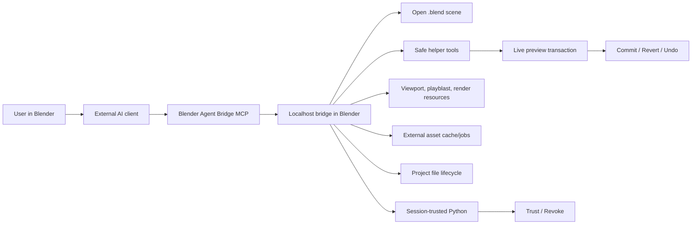

# Blender Agent Bridge

The safe, production-shaped bridge between Blender and external AI agents.

Blender Agent Bridge is a Blender extension plus a localhost MCP bridge. It lets tools such as Codex, Claude Desktop, Claude Code, Cursor, and other MCP-capable clients inspect the open Blender scene, gather visual evidence, make preview-capable edits, and run Python under explicit session trust.

<p align="center">
  
</p>

<p align="center">
  <a href="addon/claude_blender/blender_manifest.toml"></a>
  <a href="https://github.com/CallMeJones/blender-agent-bridge/releases/latest"></a>
  <a href="https://github.com/CallMeJones/blender-agent-bridge/actions/workflows/mcp-smoke.yml"></a>
  
  
  <a href="LICENSE"></a>
</p>

## 1. Install the Blender Extension

Install Blender `4.2.0` or newer. CI continuously checks Blender 4.2 LTS, 4.5 LTS, and 5.1; newer versions are allowed and use capability checks instead of an artificial maximum-version gate.

### Recommended: install from the extension repository

1. In Blender, open `Edit > Preferences > Get Extensions`.
2. Enable online access if Blender asks.
3. Press `Repositories`.
4. In the repository popover, press `+`, choose `Add Remote Repository`, and name it `Blender Agent Bridge`.
5. Paste this repository URL:

   ```text
   https://callmejones.github.io/blender-agent-bridge/index.json
   ```

6. Close the repository popover, open the down-arrow extension settings menu, and choose `Refresh Remote`.
7. Search for `Blender Agent Bridge`.
8. Press `Install`, then confirm the extension is enabled.
9. Close Preferences. In the 3D View, press `N` to open the sidebar and select the `Agent Bridge` tab.
10. Press `Start`. The panel should report that the bridge is on.

Updates use the same repository: sync it in `Get Extensions`, install the offered update, restart Blender, and copy a fresh MCP config.

### Manual fallback: install the release ZIP

1. Open the [latest GitHub release](https://github.com/CallMeJones/blender-agent-bridge/releases/latest).
2. Under **Assets**, download `claude_blender-<version>.zip`.
3. Do **not** download GitHub's generated `Source code` ZIP; it is not an installable Blender extension.
4. In Blender, open `Edit > Preferences > Get Extensions`.
5. Open the extension menu, choose `Install from Disk`, and select the downloaded `claude_blender-<version>.zip`.
6. Enable `Blender Agent Bridge`, close Preferences, open the 3D View sidebar with `N`, select `Agent Bridge`, and press `Start`.

The extension ZIP already includes the MCP server, so the recommended bundled mode needs no Python package, `pip`, `uv`, or `uvx` installation. See [Install from GitHub](docs/INSTALL_FROM_GITHUB.md) for checksum verification, command-line installation, updates, and troubleshooting.

## 2. Connect Claude, Codex, or Cursor

The MCP server is already bundled with the Blender extension. After pressing `Start`, press `Copy MCP Config`. Blender copies a complete `mcpServers.blender` JSON entry containing the correct local Python path, bridge URL, session token, version metadata, and tool-registry digest. Keep every generated `command`, `args`, and `env` value together; this generated entry is the source of truth for Codex, Cursor, Claude Code, and manual Claude Desktop setup.

| Client | Exact setup |
| --- | --- |
| **Claude Desktop** | Recommended: open the `blender-agent-bridge-<version>.mcpb` asset from the matching GitHub release and enter the bridge URL/token shown in Blender. Manual fallback: merge the complete copied `mcpServers` object into Claude Desktop's config, then fully restart it. |
| **Claude Code** | Take only the object inside `mcpServers.blender`, then run `claude mcp add-json --scope user blender '<server-object-json>'`. Run `claude mcp list`, restart Claude Code, and use `/mcp` to confirm it connected. |
| **Codex app, CLI, or IDE extension** | Do not install the MCPB. Open **Settings > MCP servers > Add server**, choose local **STDIO**, and copy the generated `command`, every `args` item, and every `env` value. Alternatively, convert the same entry to `[mcp_servers.blender]` in `~/.codex/config.toml`. Save it, select **Restart**, then use `/mcp` or `codex mcp list`. |
| **Cursor** | Do not install the MCPB. Merge the complete generated JSON into `~/.cursor/mcp.json` for all projects or `.cursor/mcp.json` for one project. Preserve other servers, refresh Cursor's MCP servers or restart Cursor, then check **Settings > MCP**. |

The MCPB installs only the Claude Desktop connector; it is not the installation format for Codex or Cursor. Install and start the Blender extension separately. The MCPB packages the same dependency-free Python MCP server code and five-tool gateway as the release. Its MCPB v0.4 `uv` runtime is managed by the host, so users do not need to install or configure Python. The sensitive token setting stays in the client configuration.

If you want a local coding agent to configure itself, copy the config in Blender and give that agent the matching one-line prompt:

**Claude Code**

```text
Install the Blender MCP config currently on my clipboard at user scope as server blender; preserve every command, argument, environment value, and existing MCP server, never print token values, then verify it with claude mcp list.
```

**Codex**

```text
Install the Blender MCP config currently on my clipboard as a user MCP server named blender; convert the JSON to Codex TOML without changing command, args, or env, preserve my existing config, never print token values, then verify it is listed and tell me to restart MCP.
```

**Cursor**

```text
Merge the Blender MCP config currently on my clipboard into my global ~/.cursor/mcp.json as server blender without deleting existing servers, never print token values, then verify Cursor can see it and tell me to refresh MCP.
```

If the agent cannot read the clipboard, use the manual route above. The generated config contains a localhost bridge token: keep it in local configuration, never paste it into an issue or public chat, and press `Copy MCP Config` again after changing the extension or bridge settings. Keep only one `blender` entry in each client, and connect only one active MCP server to a Blender bridge at a time. Full walkthroughs: [Claude](docs/clients/CLAUDE.md), [Codex](docs/clients/CODEX.md), and [Cursor](docs/clients/CURSOR.md).

## 3. Test the Connection

Keep Blender open with the bridge running, refresh or restart the MCP client, then ask:

```text
Check Blender bridge status, find and invoke the scene-object inspection tool, and make no changes.
```

The default tool list must contain exactly `blender_bridge_status`, `blender_tool_catalog`, `search_blender_tools`, `get_blender_tool_schema`, and `invoke_blender_tool`. Helpers such as `list_scene_objects` are intentionally not top-level tools: the client must find them through search, fetch their schema, and call them through the gateway. A planner naming a non-advertised helper does not mean that helper is unavailable.

For a deterministic command-line check, run `blender-bridge doctor`. It verifies the MCP executable, optional client config, bridge socket, add-on/runtime compatibility, five-tool manifest, schema lookup, and a real read-only gateway invocation. See [Connection Diagnostics](docs/CONNECTION_DIAGNOSTICS.md).

Then try a reversible edit:

```text
Move the selected cube up 1 Blender unit and make it red. Leave the change as a preview.
```

Preview edits stay pending in Blender until you use `Commit`, `Revert`, or Blender undo. Generated Python is refused while **Trust Agent Scripts** is off. With trust on, it runs immediately with the same filesystem, network, subprocess, project-file, persistent-cache, and Blender API permissions as Blender's **Run Script** command.

The public beta is live: read the [release announcement](https://github.com/CallMeJones/blender-agent-bridge/discussions/12) and share structured [beta feedback](https://github.com/CallMeJones/blender-agent-bridge/discussions/13).

## After Updates

Restart Blender, press `Start`, copy the MCP config again, replace the old client config, and refresh or restart the client. This prevents cached server paths and tool lists from keeping an older extension active.

## Why This Exists

AI agents are getting good at using tools, but Blender needs guardrails. This bridge gives agents real scene context and practical tools without turning Blender into a chat app or storing provider API keys.

- Blender stays the execution layer: scene state, viewport evidence, preview changes, binary script trust, checkpoints, and local resources.
- The external client stays the agent host: model connection, conversation memory, provider account, planning, and user chat.
- With runtime script trust active, authored object generation, modeling, animation, materials, custom nodes, rigging, and look development default to one cohesive generated Python script unless the user requests helpers or no Python. Trust-off sessions use bounded helpers instead; generated scripts are refused until trust is granted.
- Long cohesive scripts can run in an isolated background Blender process against a copied `.blend`, with polling, cancellation, and an explicitly confirmed apply step that checkpoints the live file.
- Replayable execution traces record compact gateway activity, local generated-script artifacts, timings, outcomes, and reported token usage without expanding the five-tool MCP manifest.
- Reference-model workflows persist blind evidence scorecards and bounded repair passes until they reach `ready_for_user_review` or `blocked_quality_floor`.
- Multi-view clients can fuse calibrated silhouettes and optional signed depth into a watertight surface, automatically fit that surface against all views and reconstructed landmarks, adapt topology by region and curvature, and turn remaining critiques into form-aware semantic or screen-space repairs without an external image-to-3D model.
- Connected LLMs can author persistent semantic shape programs from general SDF primitives and tapered sweeps, compile them into continuous watertight meshes with uniform or adaptive-dual extraction, target high octree depth only around important local forms, probe their fields, and revise named forms without an external model or category-specific base mesh.
- Blender has one deliberately small sidebar panel: bridge status/start-stop, `Copy MCP Config`, **Trust Agent Scripts**/**Revoke**, and pending preview **Commit**/**Revert**. Diagnostics, manifests, audit state, captures, and asset configuration stay in bridge/tool responses instead of returning as sidebar sections.
- Bounded helpers handle inspection, project files, external assets, long jobs, persistent bakes, evidence, preview decisions, and deliberately isolated edits. Operational clauses remain separate from, and do not demote, the trusted script used for authored work.

## Showcase: Egypt Dogfight

These compressed images come from the `egypt.blend` project used while testing the bridge. The agent inspected a scene, used helper/workflow tools, captured playblast and render evidence, repaired issues, kicked off longer render jobs through bridge tooling, and validated the resulting output without relying on shell scripts or hidden in-Blender chat loops.

<p align="center">
  
</p>

<p align="center">
  
</p>

| Visual evidence | Diagnostic close-up | Render/playblast review |
| --- | --- | --- |
|  |  |  |

The source `.blend` file and full 1080p videos are not committed here; the repository only includes small showcase exports so the GitHub checkout stays light. See [docs/assets/PROVENANCE.md](docs/assets/PROVENANCE.md) for their origin, hashes, licensing boundary, and known third-party-source limitations.

## What Agents Can Do

- Inspect the current scene, selection, materials, animation, rigs, cameras, nodes, render settings, and `.blend` health.
- Keep complete inspection results by default, with optional summaries, field selection, pagination, and digest-based unchanged responses for lower-token follow-ups.
- Make reversible preview edits to common objects, materials, animation, lighting, cameras, rigs, and scene organization.
- Capture viewport, playblast, inspection-render, thumbnail, and render-job evidence.
- Search and import Poly Haven or Sketchfab assets through asynchronous download and import jobs.
- Run animation and background-render workflows, including progress polling and output validation.
- Use bounded project-directory tools, or run custom Blender Python only after the user enables session script trust.

## Safety Model

Connected agents do not get blanket access by default. Enabling session script trust deliberately grants broad Blender-process access.

| Path | Behavior |
| --- | --- |
| Preview edits | Show `Commit` and `Revert` controls in Blender and retain normal Blender undo support. |
| Project tools | Restrict generic file access to the current saved project directory. Save/open/new-project operations require explicit confirmed paths. |
| Local bridge | Off by default and bound to `127.0.0.1`. Optional bearer authentication is available; without it, any local client that can reach the bridge may call its tools. |
| Generated Python | Refused while trust is off. With trust on, it has Blender **Run Script** permissions, including filesystem, network, subprocess, project-file, persistent-cache, and full Blender API access. |
| Script trust | Runtime-only and visibly revocable. It clears on Revoke, timed expiry, add-on reload, or Blender exit. Opening, creating, restoring, copying, renaming, saving, or modifying `.blend` files does not change an active grant, and file operations never extend a timed grant's expiry. Static findings are advisory, not a sandbox. |
| Credentials | Model-provider keys are never stored by the extension. Sketchfab tokens are redacted and are not saved in preferences, `.blend` files, or audit logs. |

See [SECURITY.md](SECURITY.md), [PRIVACY.md](PRIVACY.md), and [docs/SAFETY_MODEL.md](docs/SAFETY_MODEL.md) for the detailed model.

## Optional Sketchfab Auth

Poly Haven discovery and imports do not need a token. Sketchfab public search is also tokenless, but Sketchfab model downloads/imports need an API token.

Fill the empty `SKETCHFAB_API_TOKEN` field in the copied MCP config, then restart or refresh the client. The token must be available to the MCP server process; Blender Agent Bridge does not save it in preferences, `.blend` files, or audit logs.

## How It Works


```mermaid
flowchart LR
  user["User in Blender"] --> agent["External AI client"]
  agent --> mcp["Blender Agent Bridge MCP"]
  mcp --> bridge["Localhost bridge in Blender"]
  bridge --> scene["Open .blend scene"]
  bridge --> helpers["Safe helper tools"]
  bridge --> evidence["Viewport, playblast, render resources"]
  bridge --> assets["External asset cache/jobs"]
  bridge --> files["Project file lifecycle"]
  bridge --> scripts["Session-trusted Python"]
  helpers --> preview["Live preview transaction"]
  preview --> commit["Commit / Revert / Undo"]
  scripts --> trust["Trust / Revoke"]
```

The default MCP surface exposes exactly five stable gateway tools. Every Blender helper remains searchable, schema-addressable, and executable through that gateway, so clients that retrieve only a handful of tools cannot strand themselves with planners but no execution path. An opt-in `direct` surface restores the previous curated direct helpers, while `full` is reserved for compatibility and debugging. Initialization and tool definitions are deterministic for provider prompt-cache reuse, and content-free payload telemetry identifies response-size hotspots without storing scene output. Blender owns the open scene, previews, evidence, and trusted execution; the external MCP client owns the model, conversation, provider account, and provider cache policy.

The gateway catalog also includes versioned quality benchmark tasks, durable model-review state, execution traces, and async trusted-script jobs. These are discovered and invoked on demand, so quality and observability improve without paying the token cost of more top-level tools.

For reference construction and form repair, see [docs/MULTIVIEW_RECONSTRUCTION.md](docs/MULTIVIEW_RECONSTRUCTION.md) and [docs/SEMANTIC_SCULPTING.md](docs/SEMANTIC_SCULPTING.md).

See [docs/EXTERNAL_BRIDGE_MCP.md](docs/EXTERNAL_BRIDGE_MCP.md) for setup and troubleshooting.

Client-specific instructions: [Codex](docs/clients/CODEX.md), [Claude](docs/clients/CLAUDE.md), [Cursor](docs/clients/CURSOR.md), [VS Code/Cline/Roo](docs/clients/VSCODE.md), [ChatGPT](docs/clients/CHATGPT.md), [Gemini CLI](docs/clients/GEMINI.md), [OpenCode](docs/clients/OPENCODE.md), and [Ollama hosts](docs/clients/OLLAMA.md).

Community: browse the [curated showcase](docs/SHOWCASE.md), propose a [showcase submission](https://github.com/CallMeJones/blender-agent-bridge/issues/new?template=showcase.yml), join [Discussions](https://github.com/CallMeJones/blender-agent-bridge/discussions), report [issues](https://github.com/CallMeJones/blender-agent-bridge/issues), or read [Contributing](CONTRIBUTING.md) and [Adding a Tool](docs/ADDING_A_TOOL.md).

## Try These Prompts

With an object selected:

```text
Move the selected cube up 1 Blender unit and make it red.
```

```text
Make the selected cube bounce twice over 72 frames, getting smaller each bounce. Check it against the brief and leave it as a preview.
```

```text
Capture close-up inspection renders of the selected vehicle underside, review them against the brief, and suggest repair operations.
```

```text
Search Poly Haven for a sunset HDRI, cache it as an external asset job, poll until it is ready, then queue the import into the world as a preview.
```

```text
Render a playblast as a background job, poll it, assemble the MP4, and validate the output.
```

Live helper changes, including external asset imports, remain pending until you use `Commit`, `Revert`, or Blender undo. Generated Python never enters a pending approval queue: trust off refuses it, and trust on runs it immediately with Blender Run Script-equivalent permissions.

## Development

Contributor setup, build commands, and the complete test matrix live in [Development](docs/DEVELOPMENT.md), [Testing Guide](docs/TESTING_GUIDE.md), and [Release](docs/RELEASE.md). See [Contributing](CONTRIBUTING.md) before opening a change, and [Adding a Tool](docs/ADDING_A_TOOL.md) for registry and handler conventions.

The [documentation index](docs/README.md) links the architecture, MCP, preview, safety, client, and launch guides.

## License

Blender Agent Bridge source and release ZIPs are licensed under the GNU General Public License, version 3 or any later version. The Blender extension manifest declares this as `SPDX:GPL-3.0-or-later`; see [LICENSE](LICENSE) for the full license text. Release ZIPs include the license file at the package root. The separately distributed showcase media under `docs/assets/` is governed by [its provenance notice](docs/assets/PROVENANCE.md), not the extension's GPL license.
