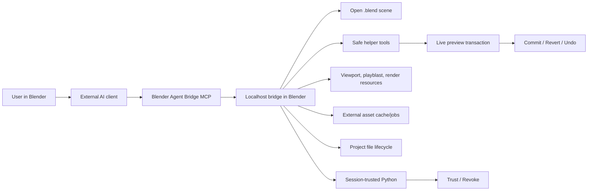

# Blender Agent Bridge

The local, safety-aware bridge between Blender and external AI agents.

Blender Agent Bridge is a Blender extension plus a localhost MCP server. It lets tools such as Codex, Claude Desktop, Claude Code, Cursor, and other MCP-capable clients inspect the open Blender scene, gather visual evidence, make reversible edits, and run Blender Python only when you explicitly enable session trust.

<p align="center">
  
</p>

<p align="center">
  <a href="addon/claude_blender/blender_manifest.toml"></a>
  <a href="https://github.com/CallMeJones/blender-agent-bridge/releases/latest"></a>
  <a href="https://github.com/CallMeJones/blender-agent-bridge/actions/workflows/mcp-smoke.yml"></a>
  
  
  <a href="LICENSE"></a>
</p>

<p align="center">
  <a href="https://polyhaven.com/"></a>
  <a href="https://sketchfab.com/"></a>
  <a href="https://platform.tripo3d.ai/"></a>
  <a href="https://www.meshy.ai/"></a>
  <a href="https://github.com/VAST-AI-Research/TripoSR"></a>
</p>

## What You Get

- Scene-aware agent workflows without putting a chat app or model-provider key inside Blender.
- Read-only inspection of objects, materials, animation, rigs, cameras, nodes, render settings, and `.blend` health.
- Viewport, playblast, inspection-render, thumbnail, and render-job evidence that agents can review before changing the scene.
- Reversible helper edits with visible **Commit** and **Revert** controls in Blender.
- Optional session-trusted Python for broad authored work when you deliberately enable **Trust Agent Scripts**.
- Optional Poly Haven, Sketchfab, Tripo, Meshy, local TripoSR, and self-hosted studio workflows with provider-specific consent and provenance.

## Quick Start

### 1. Install the Blender extension

Install Blender `4.2.0` or newer. The release workflow continuously checks Blender 4.2 LTS, 4.5 LTS, and 5.1; newer versions are allowed through capability checks instead of an artificial maximum-version gate.

Recommended install:

1. In Blender, open `Edit > Preferences > Get Extensions`.
2. Enable online access if Blender asks.
3. Press `Repositories`.
4. Press `+`, choose `Add Remote Repository`, and name it `Blender Agent Bridge`.
5. Paste this repository URL:

   ```text
   https://callmejones.github.io/blender-agent-bridge/index.json
   ```

6. Close the repository popover, open the extension settings menu, and choose `Refresh Remote`.
7. Search for `Blender Agent Bridge`.
8. Press `Install`, then confirm the extension is enabled.
9. In the 3D View, press `N` and open the `Agent Bridge` tab.
10. Press `Start`. The panel should report that the bridge is on.

Manual fallback:

1. Open the [latest GitHub release](https://github.com/CallMeJones/blender-agent-bridge/releases/latest).
2. Under **Assets**, download `claude_blender-<version>.zip`.
3. Do **not** download GitHub's generated `Source code` ZIP; it is not an installable Blender extension.
4. In Blender, open `Edit > Preferences > Get Extensions`.
5. Open the extension menu, choose `Install from Disk`, and select the downloaded ZIP.
6. Enable `Blender Agent Bridge`, open the `Agent Bridge` sidebar tab, and press `Start`.

The extension ZIP already includes the MCP server. The recommended bundled mode does not require `pip`, `uv`, or `uvx`. For checksums, command-line installation, update behavior, and troubleshooting, see [Install From GitHub](docs/INSTALL_FROM_GITHUB.md).

### 2. Connect an MCP client

After pressing `Start`, press `Copy MCP Config` in Blender. That copies the complete `mcpServers.blender` entry with the correct local Python path, bridge URL, session token, version metadata, and tool-registry digest.

Keep every generated `command`, `args`, and `env` value together. The copied config is the source of truth for Codex, Cursor, Claude Code, and manual Claude Desktop setup.

| Client | Setup |
| --- | --- |
| **Claude Desktop** | Recommended: open the `blender-agent-bridge-<version>.mcpb` asset from the matching GitHub release and enter the bridge URL/token shown in Blender. Manual fallback: merge the complete copied `mcpServers` object into Claude Desktop's config, then fully restart Claude Desktop. |
| **Claude Code** | Take only the object inside `mcpServers.blender`, then run `claude mcp add-json --scope user blender '<server-object-json>'`. Run `claude mcp list`, restart Claude Code, and use `/mcp` to confirm it connected. |
| **Codex app, CLI, or IDE extension** | Do not install the MCPB. Open **Settings > MCP servers > Add server**, choose local **STDIO**, and copy the generated `command`, every `args` item, and every `env` value. Alternatively, convert the same entry to `[mcp_servers.blender]` in `~/.codex/config.toml`. Save it, select **Restart**, then use `/mcp` or `codex mcp list`. |
| **Cursor** | Do not install the MCPB. Merge the complete generated JSON into `~/.cursor/mcp.json` for all projects or `.cursor/mcp.json` for one project. Preserve other servers, refresh Cursor's MCP servers or restart Cursor, then check **Settings > MCP**. |

The MCPB is only the Claude Desktop connector format. Install and start the Blender extension separately for every client.

The generated config includes a localhost bridge token. Keep it in local configuration, never paste it into issues or public chat, and press `Copy MCP Config` again after changing the extension or bridge settings. Keep only one `blender` entry in each client, and connect only one active MCP server to a Blender bridge at a time.

Client-specific walkthroughs are available for [Claude](docs/clients/CLAUDE.md), [Codex](docs/clients/CODEX.md), [Cursor](docs/clients/CURSOR.md), [VS Code/Cline/Roo](docs/clients/VSCODE.md), [ChatGPT](docs/clients/CHATGPT.md), [Gemini CLI](docs/clients/GEMINI.md), [OpenCode](docs/clients/OPENCODE.md), and [Ollama hosts](docs/clients/OLLAMA.md).

### 3. Test the connection

Keep Blender open with the bridge running, refresh or restart the MCP client, then ask:

```text
Check Blender bridge status, find and invoke the scene-object inspection tool, and make no changes.
```

The default MCP tool list contains exactly `blender_bridge_status`, `blender_tool_catalog`, `search_blender_tools`, `get_blender_tool_schema`, and `invoke_blender_tool`. Helpers such as `list_scene_objects` are intentionally found through search, inspected through schema lookup, and called through the gateway.

Then try a reversible edit:

```text
Move the selected cube up 1 Blender unit and make it red. Leave the change as a preview.
```

Helper preview edits stay pending in Blender until you use **Commit**, **Revert**, or Blender undo. Generated Python is refused while **Trust Agent Scripts** is off. With trust on, generated scripts run immediately with Blender **Run Script**-equivalent permissions and normal Blender undo/checkpoint behavior.

For deterministic diagnostics, use `blender-bridge doctor` when that command is available in your MCP runtime. It verifies the executable, optional client config, bridge socket, add-on/runtime compatibility, five-tool manifest, schema lookup, and a real read-only gateway invocation. See [Connection Diagnostics](docs/CONNECTION_DIAGNOSTICS.md).

## Try These Prompts

With an object selected:

```text
Move the selected cube up 1 Blender unit and make it red.
```

```text
Make the selected cube bounce twice over 72 frames, getting smaller each bounce. Check it against the brief and leave it as a preview.
```

```text
Capture close-up inspection renders of the selected vehicle underside, review them against the brief, and suggest repair operations.
```

```text
Search Poly Haven for a sunset HDRI, cache it as an external asset job, poll until it is ready, then queue the import into the world as a preview.
```

```text
Check which image-to-3D providers are ready and explain their cost, privacy, and quality tradeoffs. Do not start a job.
```

```text
Generate a 3D model from these confirmed reference-image paths. If more than one provider is available, ask me which provider to use before starting anything.
```

```text
Render a playblast as a background job, poll it, assemble the MP4, and validate the output.
```

## Safety Model

Connected agents do not get blanket access by default. Blender stays the execution layer; the external client stays the model, conversation, planning, and account layer.

| Path | What happens |
| --- | --- |
| Local bridge | Off by default and bound to `127.0.0.1`. Optional bearer authentication is available; without it, any local client that can reach the bridge may call its tools. |
| Preview edits | Show **Commit** and **Revert** controls in Blender and retain normal Blender undo support. |
| Project tools | Restrict generic file access to the current saved project directory. Save, open, and new-project operations require explicit confirmed paths. |
| Generated Python | Refused while trust is off. With trust on, it has Blender **Run Script** permissions, including filesystem, network, subprocess, project-file, persistent-cache, and full Blender API access. |
| Script trust | Runtime-only and visibly revocable. It clears on **Revoke**, timed expiry, add-on reload, or Blender exit. |
| Credentials | Provider keys are redacted from responses. Optional persistence uses the operating system credential facility where available, with a clearly reported user-only file fallback; keys are never written to Blender preferences, `.blend` files, manifests, or audit logs. |

See [SECURITY.md](SECURITY.md), [PRIVACY.md](PRIVACY.md), and [Safety Model](docs/SAFETY_MODEL.md) for the detailed model.

## Optional Providers

Every provider is optional. Turning off **Allow Third-Party Uploads** disables hosted generation without disabling scene inspection, preview edits, trusted scripts, project tools, rendering, Poly Haven, local TripoSR, or a configured self-hosted studio endpoint.

| Provider | Use it for | Setup |
| --- | --- | --- |
| [Poly Haven](https://polyhaven.com/) | CC0 HDRIs, PBR textures, and models. | No key required. |
| [Sketchfab](https://sketchfab.com/) | Public model search and authenticated glTF downloads with attribution and license provenance. | Search needs no key; downloads need a Sketchfab API token. |
| [Tripo](https://platform.tripo3d.ai/) | Hosted single-image and calibrated multi-view image-to-3D jobs. | API key plus **Allow Third-Party Uploads**. Hosted jobs require explicit spend approval in Blender. |
| [Meshy](https://docs.meshy.ai/en/api) | Hosted single-image and multi-image generation with Meshy 7, Meshy T2 Smart Topology, remeshing, textures, and thumbnails. | API key plus **Allow Third-Party Uploads**. Hosted jobs require explicit spend approval in Blender. |
| [TripoSR](https://github.com/VAST-AI-Research/TripoSR) | Local single-image blockouts without vendor upload or API credits. | Separate Python environment, TripoSR checkout, and compatible PyTorch installation. |
| **Studio endpoint** | Self-hosted single-view or multi-view generation behind a small HTTP API. | Local/private-network HTTP or HTTPS service URL, optional bearer token. The service is not bundled. |

When more than one generation provider is ready, the bridge asks which provider to use and starts nothing until the user answers. Hosted jobs show a provider-specific spend estimate before submission; provider pricing can change, so review the provider's own billing page before approval.

See [Generation Providers](docs/GENERATION_PROVIDERS.md) for setup, reference limits, provider-choice behavior, local TripoSR notes, and the self-hosted studio contract.

## Showcase

These examples are compressed documentation exports, not stock media or GPL-covered source assets. See [showcase provenance](docs/assets/PROVENANCE.md) before reusing any media.

### Agent-Assisted Scene Work

The Egypt dogfight test scene exercised scene inspection, helper/workflow tools, playblast and render evidence, targeted repair, and background rendering. The source `.blend` file and full 1080p videos are not distributed.

<p align="center">
  
</p>

| Chase camera | Wide render | Inspection close-up | Playblast evidence |
| --- | --- | --- | --- |
|  |  |  |  |

### Material Render Studies

These stills were exported from maintainer-supplied `.blend` examples using Blender 5.1 material rendering for documentation.

| Desk lamp | Fastback car | Orchid window study |
| --- | --- | --- |
|  |  |  |

### Image-To-3D Provider Evidence

This tracked Meshy provider run used four brand-free references to exercise Blender-side spend approval, multi-image upload, provider polling, GLB caching, preview import, sanitized provenance, semantic orientation review, material preservation, and front/side/rear/top evaluation.

[](docs/assets/meshy-vehicle-multiview-report.md)

The generated vehicle is useful evidence for a coherent textured concept/blockout. It is not presented as automatically edit-ready production topology. Read the [vehicle evidence report](docs/assets/meshy-vehicle-multiview-report.md) for the topology findings and limitations.

Browse the [curated showcase](docs/SHOWCASE.md), propose a [showcase submission](https://github.com/CallMeJones/blender-agent-bridge/issues/new?template=showcase.yml), join [Discussions](https://github.com/CallMeJones/blender-agent-bridge/discussions), or report [issues](https://github.com/CallMeJones/blender-agent-bridge/issues).

## How It Works


```mermaid
flowchart LR
  user["User in Blender"] --> agent["External AI client"]
  agent --> mcp["Blender Agent Bridge MCP"]
  mcp --> bridge["Localhost bridge in Blender"]
  bridge --> scene["Open .blend scene"]
  bridge --> helpers["Safe helper tools"]
  bridge --> evidence["Viewport, playblast, render resources"]
  bridge --> assets["External asset cache/jobs"]
  bridge --> files["Project file lifecycle"]
  bridge --> scripts["Session-trusted Python"]
  helpers --> preview["Live preview transaction"]
  preview --> commit["Commit / Revert / Undo"]
  scripts --> trust["Trust / Revoke"]
```

The default MCP surface exposes five stable gateway tools. Every Blender helper remains searchable, schema-addressable, and executable through that gateway, so clients that retrieve only a handful of tools still have a reliable route from planning to execution.

For deeper implementation notes, see [Architecture](docs/ARCHITECTURE.md), [External Bridge MCP](docs/EXTERNAL_BRIDGE_MCP.md), [Multiview Reconstruction](docs/MULTIVIEW_RECONSTRUCTION.md), [Semantic Sculpting](docs/SEMANTIC_SCULPTING.md), and [Implicit Shape Programs](docs/IMPLICIT_SHAPE_PROGRAMS.md).

Release confidence is tracked through the tagged [build and smoke workflow](https://github.com/CallMeJones/blender-agent-bridge/actions/workflows/mcp-smoke.yml), [Release](docs/RELEASE.md), [Testing Guide](docs/TESTING_GUIDE.md), and [Next On The Roadmap](docs/ROADMAP_NEXT.md).

## Development

Contributor setup, build commands, and the complete test matrix live in [Development](docs/DEVELOPMENT.md), [Testing Guide](docs/TESTING_GUIDE.md), and [Release](docs/RELEASE.md). Current priorities and deliberately deferred work live in [Next On The Roadmap](docs/ROADMAP_NEXT.md). See [Contributing](CONTRIBUTING.md) before opening a change, and [Adding A Tool](docs/ADDING_A_TOOL.md) for registry and handler conventions.

The [documentation index](docs/README.md) links the architecture, MCP, preview, safety, client, and launch guides.

## License

Blender Agent Bridge source and release ZIPs are licensed under the GNU General Public License, version 3 or any later version. The Blender extension manifest declares this as `SPDX:GPL-3.0-or-later`; see [LICENSE](LICENSE) for the full license text. Release ZIPs include the license file at the package root. The separately distributed showcase media under `docs/assets/` is governed by [its provenance notice](docs/assets/PROVENANCE.md), not the extension's GPL license.
