# Community Showcase

Share what Blender Agent Bridge helped you build, especially examples that demonstrate inspection, visual evidence, reversible edits, or safety-aware workflows. Use the [Showcase submission form](https://github.com/CallMeJones/blender-agent-bridge/issues/new?template=showcase.yml); accepted entries may be linked here or featured on the project site.

The included project media has a restricted documentation-only licensing boundary. Read [the complete provenance notice](assets/PROVENANCE.md) before reusing or submitting media.

## The Last Vault: Egypt Dogfight

This historical test scene exercised scene inspection, helper/workflow tools, playblast and render evidence, targeted repair, and background rendering. The source `.blend` and full-resolution video are intentionally not distributed.

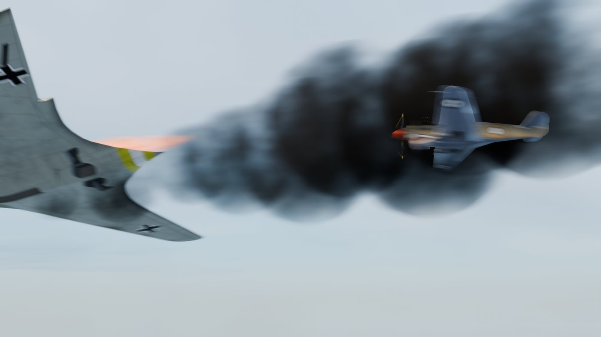

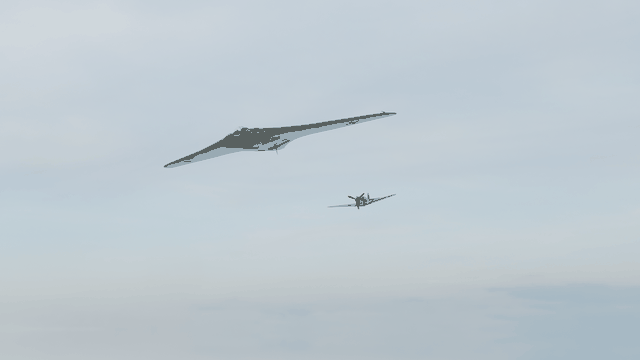

| Chase camera | Wide render | Inspection close-up | Playblast evidence |
| --- | --- | --- | --- |
| 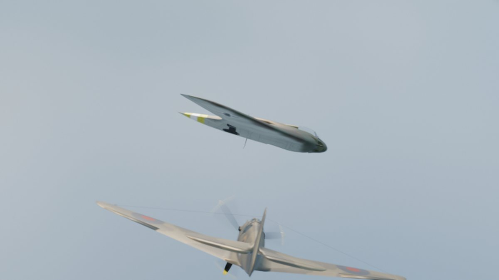 | 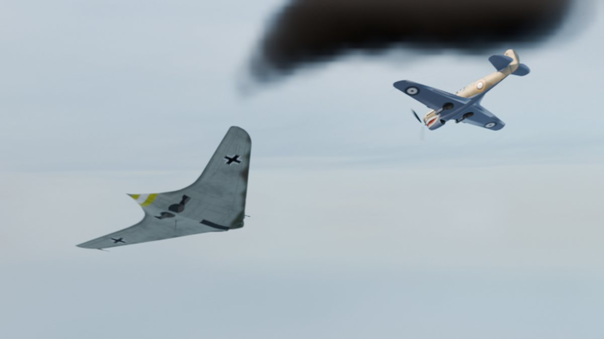 | 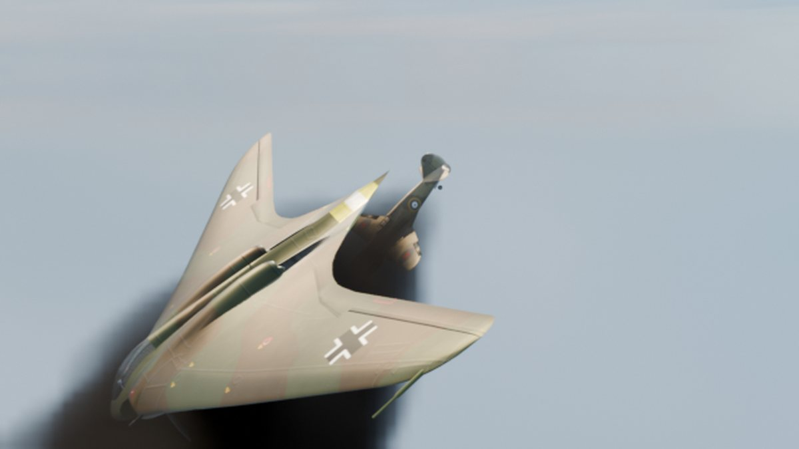 | 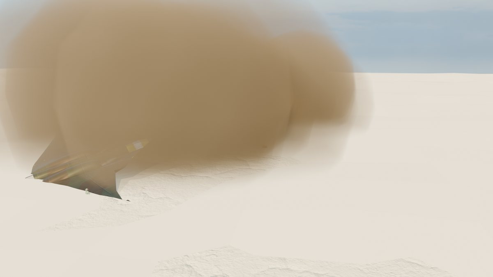 |

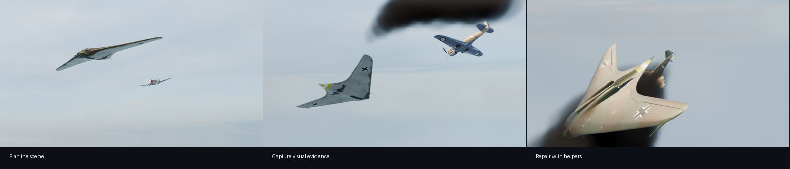

## Material Render Studies

These stills were exported from maintainer-supplied `.blend` examples using Blender 5.1 material rendering. The source `.blend` files are not distributed in the repository.

| Desk lamp | Fastback car | Orchid window study |
| --- | --- | --- |
| 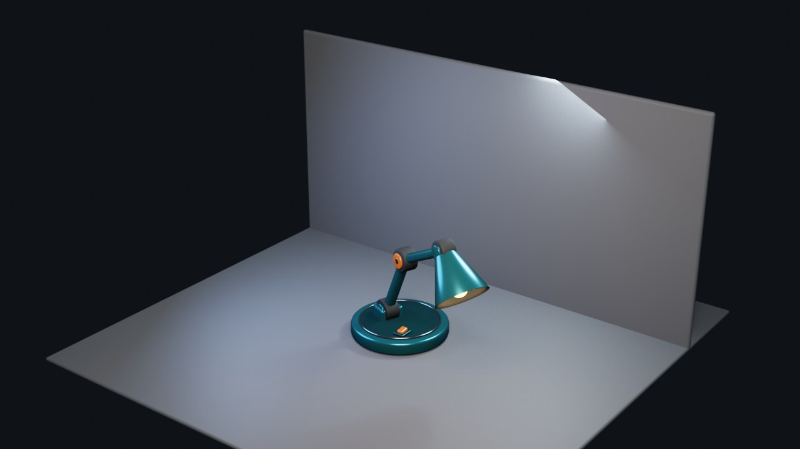 | 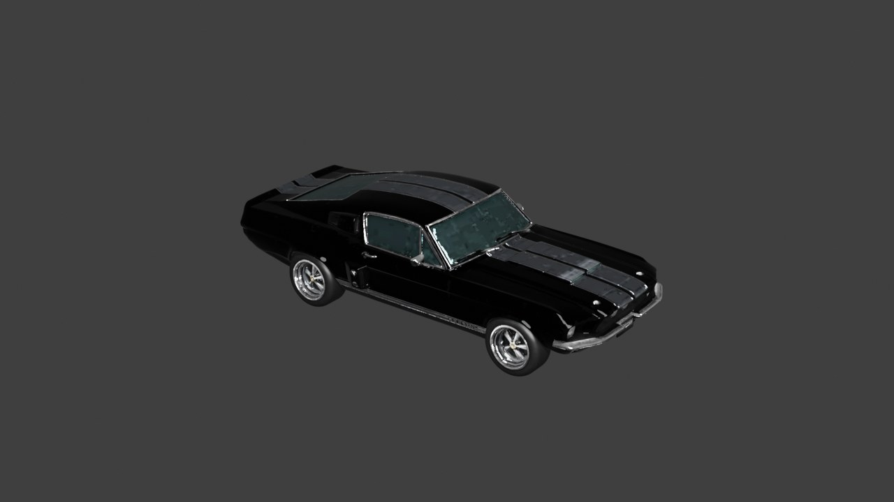 | 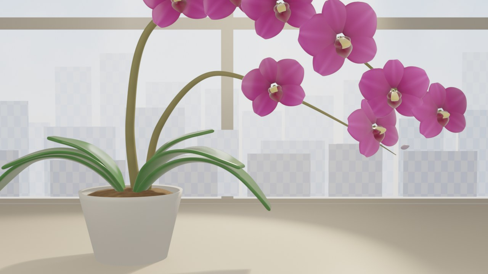 |

The lamp example shows material assignment, practical light emission, and simple staged product presentation. The car example shows glossy paint, glass, chrome, and modeled detail. The orchid example shows a complete staged organic scene with petals, leaves, pot, and background composition.

## Meshy Multi-Image Vehicle Evidence

This sanitized provider run documents a four-reference Meshy image-to-3D job performed for the project on 2026-08-11. It exercised Blender-side spend approval, four-image upload, provider polling, GLB caching, preview import, sanitized provenance, semantic orientation review, material preservation, and front/side/rear/top evaluation.

[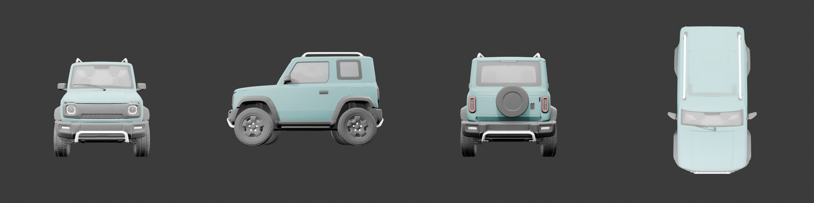](assets/meshy-vehicle-multiview-report.md)

The result is positive evidence for a coherent textured concept or blockout and for the complete paid multi-image provider path. It is not evidence that provider output is automatically edit-ready production topology. Read the [full vehicle evidence report](assets/meshy-vehicle-multiview-report.md) for topology findings, material notes, and limitations.

## Submission Checklist

- Explain the workflow and which bridge capabilities mattered.
- Include one representative still, GIF, or short video link.
- Confirm you have permission to publish every submitted asset.
- Remove API keys, bridge tokens, private paths, proprietary source files, and personal data.
- Disclose external models, textures, HDRIs, and their licenses.
- State the Blender, extension, MCP client, and runtime versions.
- Describe whether changes were previewed, committed, reverted, or run under session trust.

Submission does not guarantee inclusion. Maintainers may request smaller files, clearer provenance, accessibility text, or removal of unsafe instructions before publication.
